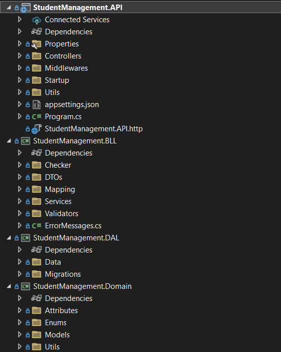
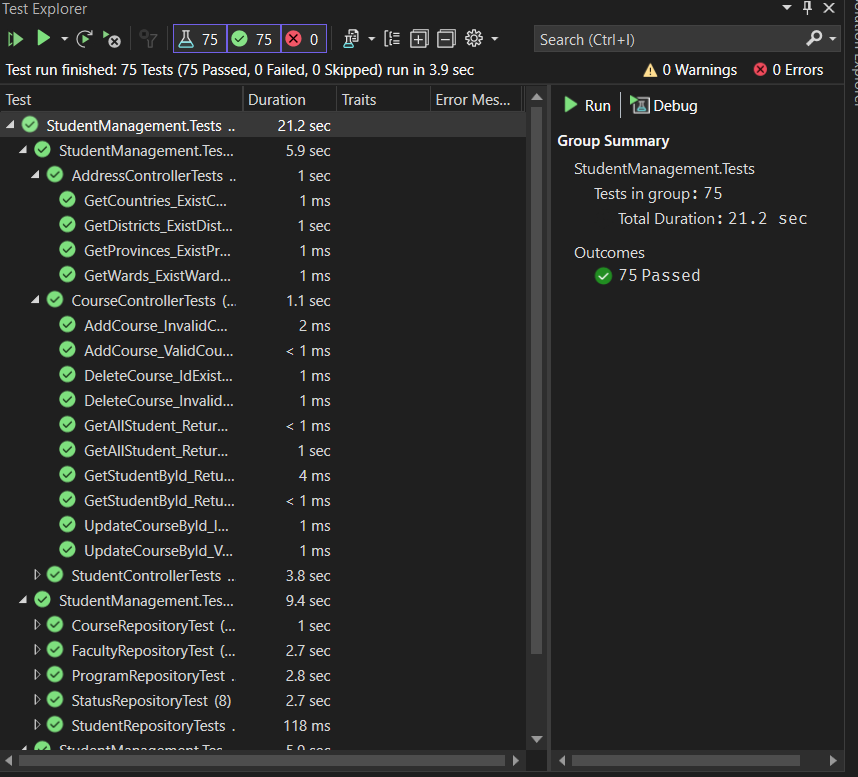

# 🧑‍💻 Coding Standards

### Đặt tên

| Thành phần     | Quy ước       | Ví dụ                |
|----------------|----------------|-----------------------|
| Biến & hàm     | `camelCase`     | `studentId`, `getName()` |
| Class & File   | `PascalCase`    | `StudentService.cs`   |
| Interface      | `I` + Pascal    | `IStudentRepository`  |

### Tổ chức code

- Tách theo thư mục: `Controllers/Services/DTOs/...`
- Controller chỉ gọi service, **không chứa logic xử lý**

### Clean Code

- ❌ Không hardcode – dùng config hoặc constant
- ❌ Không để hàm dài quá 50 dòng
- ✅ Tên hàm thể hiện rõ ý định: `AddStudent`, `GetById`

### Xử lý lỗi

- Dùng `try-catch` ở tầng service
- Dùng `throw` kèm message rõ ràng
- API trả response chuẩn HTTP status + message

### Viết Test

- Ưu tiên test tầng service, business logic
- Dùng `xUnit`
- Không test trực tiếp database

</br>

# 🧠 Overview of Architecture

### Tech Stack

- **Frontend**: Next.js 14 (TypeScript)
- **Backend**: ASP.NET Core Web API (.NET 9)
- **Database**: SQL Server + Entity Framework Core

### Backend
Triển khai **Clean Architecture**, </br>
```
API → Application (BLL) → Domain
           ↓
         DAL
```
#### Layers
- **Domain**: Entities
- **Application (BLL)**: DTO, Services, Validation, Interfaces
- **DAL**: Repository, DbContext
- **API**: Controllers, Middleware, DI, Swagger

### Frontend
- **Framework**: Next.js 14 App Router
- **Language**: TypeScript
- **i18n**: next-intl
- **API Communication**: REST (JSON)

### Database
- **DBMS**: SQL Server (Docker)
- **ORM**: Entity Framework Core
- **Approach**: Code First with Migrations

### Data Flow
```
Next.js → REST API → Controllers → Services → Repository → EF Core → SQL Server (Docker)
```


</br>

# 📁 Source code organization
### Backend

- `StudentManagement.API`: Project API cung cấp các endpoints để tương tác với hệ thống.
    - **`Controllers/`**: Chứa các controller định nghĩa các API endpoint.
    - **`Middlewares/`**: Chứa cấu hình các Middleware.
    - **`Startup/`**: Chứa các class Extension để cấu hình app.
    - **`appsettings.json`**: Tệp cấu hình chính của ứng dụng, lưu trữ thông tin về database, logging, các API bên thứ 3,...
    - **`Utils`**: Chứa class ApiResponse để chuẩn hóa phản hồi từ API
    - **`Program.cs`**: Entry point của ứng dụng API.
- `StudentManagement.BLL`: Project Business Logic Layer (BLL) chứa các logic nghiệp vụ.
    - **`DTOs/`**: Chứa các Data Transfer Object (DTO) để trao đổi dữ liệu giữa các tầng.
    - **`Checker/`**: Chứa class để thực hiện kiểm tra dữ liệu trước khi thực hiện CRUD.
    - **`Validators/`**: Chứa class để thực hiện kiểm tra định dạng của dữ liệu.
    - **`Services/`**: Chứa các service xử lý logic nghiệp vụ.
    - **`Mapping/`**: Cấu hình AutoMapper để ánh xạ dữ liệu giữa Enity và DTO.

- `StudentManagement.DAL`: Project Data Access Layer (DAL) để truy xuất và quản lý dữ liệu.
    - **`Data/`**: Chứa các ApplicationDbcontext, AuditInterceptor, utils và repositories để làm việc với database.
    - **`Migrations/`**: Chứa các tệp migration để cập nhật database schema.
- `StudentManagement.Domain`: Project chứa các định nghĩa thực thể và cấu trúc dữ liệu chung.
    - **`Enums/`**: Chứa các enum dùng chung trong hệ thống.
    - **`Models/`**: Chứa các model định nghĩa thực thể dữ liệu.
    - **`Utils/`**: Chứa các hàm tiện ích chung.
    - **`Attributes`**: Chứa class UniqueConstrainAttribute dùng để đánh dấu một thuộc tínhtrong model cần đảm bảo tính duy nhất.
- `StudentManagement.Tests`: Project chứa các unit tests cho ứng dụng.
    - **`Units/`**: Chứa các unit test của ứng dụng.
### Frontend

- **`public`**: chứa các image, icon,… của trang web
- **`api`**: định nghĩa các API sẽ dùng trong trang web
- **`app`**: định nghĩ giao diện chính cho tưng trang trong trang web
- **`components`**: chứa các thành phần tái sử dụng trong cả project
- **`constants`**: định nghĩa các hằng số
- **`context`**: định nghĩa cắc context để chia sẻ dữ liệu
- **`hooks`**: định nghĩa các custom hook trong project
- **`theme`**: định nghĩa các màu, text,.. trong project
- **`types`**: định nghĩa các type dùng chung trong project
- **`utils`**: các tiện ích tái sử dụng trong project
- **`.env`**: file môi trường (chứa API keys, biến môi trường)
- **`.gitignore`**: file bỏ qua khi đẩy lên Git
- **`eslint.config.mjs`**:cấu hình ESLint (kiểm tra lỗi code)
- **`next-env.d.ts`**: hỗ trợ TypeScript cho Next.js
- **`next.config.ts`**: cấu hình Next.js (ví dụ: rewrites, redirects)
- **`package.json`**: danh sách package, scripts
- **`package-lock.json`**: khóa phiên bản package (đảm bảo cài đúng)
  

</br>

# 🚀 Getting Started with Your App Development
Tải Source Code: `git clone https://github.com/nhankhtn/AIers-Ex-TKPM.git`

### Setup Frontend
```sh
# Di chuyển vào thư mục frontend
cd frontend

# Tạo file .env
# Linux / macOS:
touch .env
# Windows (PowerShell):
New-Item -Path . -Name ".env" -ItemType "File"

# Trong file .env, thêm biến môi trường để gọi API:
# NEXT_PUBLIC_HOST là URL backend
echo "NEXT_PUBLIC_HOST=http://localhost:5231" >> .env

# Cài dependencies
npm install
# Nếu lỗi: npm install --force hoặc yarn install

# Build frontend
npm run build

# Khởi chạy ứng dụng
npm start
```

### Setup Database
#### Chạy Container Docker **SQL Server**
```sh
docker run -e "ACCEPT_EULA=Y" -e "MSSQL_SA_PASSWORD=SqlServer@123" -p 1433:1433 --name student_sql -d mcr.microsoft.com/mssql/server:2022-latest
```

### Setup Backend

#### Cấu hình file `appsettings.json` trong thư mục `StudentManagement.API` với cấu hình database đã tạo

```json
{
  "ConnectionStrings": {
    "DefaultConnection": "Server=localhost,1433;Database=StudentManagementDb;User Id=sa;Password=SqlServer@123;TrustServerCertificate=True;"
  }
}
```
#### Chạy các migrations
- Vào thư mục `Backend`
```sh
cd Backend
```
- Mở terminal và nhập lệnh sau để tạo table cho Database
:
```sh
dotnet ef database update -s ./StudentManagement.API -p ./StudentManagement.DAL
```
#### Chạy script `data.sql` trong thư mục `Backend/scripts`

#### Chạy Ctrl + F5 để Run Server
Server hoạt động ở </br>
`https://localhost:44324` với IIS Express </br>
`http://localhost:5231` với http </br>
`http://localhost:7143` với https

</br>

# 📚 Database Schema

<a href="https://gist.github.com/Phatdz2710/c1393fc2c78419dc843aa2282f05160f"
   target="_blank"
   style="color:#1e90ff; font-size:18px; font-weight:bold; text-decoration:none;">
   👉 Click để xem FULL schema code trên Gist
</a>

<p style="color:#888; font-size:14px;">Chứa toàn bộ CREATE TABLE, constraint, comment,...</p>

</br>

# ✏️ Updating an Existing Entity

Để cập nhật một entity đã tồn tại trong database, thực hiện theo các bước sau:

```csharp
// Controller sử dụng method update của Service
[HttpPut("{id}")]
public async Task<ActionResult<ApiResponse<StudentDTO>>> UpdateStudent(string id, StudentDTO updateStudentDTO)
{
    var result = await _studentService.UpdateStudentAsync(id, updateStudentDTO);
    ...
}

// Service tìm Entity theo ID và gắn các giá trị mới từ DTO qua Entity qua Mapping, sau đó gọi phương thức Update của Repository
public async Task<Result<StudentDTO>> UpdateStudentAsync(string studentId, StudentDTO studentDTO)
{
    ...
    var resExistStudent = await _studentRepository.GetStudentByIdAsync(studentId);
    if (resExistStudent is null) return Result<StudentDTO>.Fail("STUDENT_NOT_FOUND", ErrorMessages.StudentNotFound);

    _mapper.Map(studentDTO, resExistStudent);

    var res = await _studentRepository.UpdateStudentAsync(resExistStudent);
    ...
}
```

</br>

# ♻️ Inversion of Control & Dependency Injection
```csharp
// Cấu hình Dependency
public static class DepedenciesConfig
{
    public static void AddDepedencies(this WebApplicationBuilder builder)
    {
      ...
      builder.Services.AddScoped<IProgramService, ProgramService>();
      builder.Services.AddScoped<IFacultyService, FacultyService>();
      builder.Services.AddScoped<IStudentStatusService, StudentStatusService>();
      ...
    }
}

// Sử dụng Dependency Injection
public static void Main(string[] args)
{
    var builder = WebApplication.CreateBuilder(args);

    builder.AddDepedencies();
    ...
}

// Tạo Interface
public interface IFacultyService
{
  ...
}

// Service dùng DI
public class FacultyService : IFacultyService
{
    private readonly IFacultyRepository _facultyRepository;
    private readonly IMapper _mapper;

    public FacultyService(IFacultyRepository facultyRepository, IMapper mapper)
    {
        _facultyRepository = facultyRepository;
        _mapper = mapper;
    }
    ...
}
```
</br>

# 🛡️ Data Validation
| Field   | Validation Rule                            | Error Code         | Message                             |
|---------|---------------------------------------------|---------------------|--------------------------------------|
| `Course` | Phải từ năm **2000 trở đi** (`>= 2000`)     | `INVALID_COURSE`   | Khóa học không hợp lệ.              |
| `Email`  | Phải hợp lệ theo `ValidateEmailAsync()`    | `INVALID_EMAIL`    | Email không đúng định dạng.         |
| `Phone`  | Phải là số điện thoại hợp lệ (qua lib libphonenumber) | `INVALID_PHONE`    | Số điện thoại không đúng dịnh dạng. |
</br>
# 🧪 Unit Testing
#### Kết quả chạy Unit Test </br>

</br>


