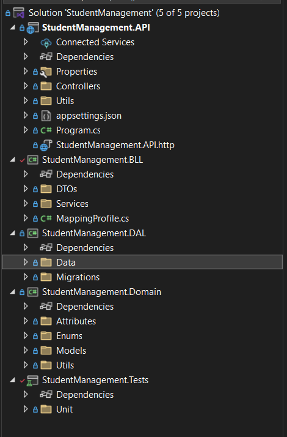

# STUDENT MANAGEMENT

## CẤU TRÚC THƯ MỤC

### Backend:

- `StudentManagement.API`: Project API cung cấp các endpoints để tương tác với hệ thống.
    - **`Controllers/`**: Chứa các controller định nghĩa các API endpoint.
    - **`appsettings.json`**: Tệp cấu hình chính của ứng dụng, lưu trữ thông tin về database, logging, các API bên thứ 3,...
    - **`Utils`**: Chứa class ApiResponse để chuẩn hóa phản hồi từ API
    - **`Program.cs`**: Entry point của ứng dụng API.
- `StudentManagement.BLL`: Project Business Logic Layer (BLL) chứa các logic nghiệp vụ.
    - **`DTOs/`**: Chứa các Data Transfer Object (DTO) để trao đổi dữ liệu giữa các tầng.
    - **`Services/`**: Chứa các service xử lý logic nghiệp vụ.
    - **`MappingProfile.cs`**: Cấu hình AutoMapper để ánh xạ dữ liệu giữa Enity và DTO.

- `StudentManagement.DAL`: Project Data Access Layer (DAL) để truy xuất và quản lý dữ liệu.
    - **`Data/`**: Chứa các ApplicationDbcontext, AuditInterceptor, utils và repositories để làm việc với database.
    - **`Migrations/`**: Chứa các tệp migration để cập nhật database schema.
- `StudentManagement.Domain`: Project chứa các định nghĩa thực thể và cấu trúc dữ liệu chung.
    - **`Enums/`**: Chứa các enum dùng chung trong hệ thống.
    - **`Models/`**: Chứa các model định nghĩa thực thể dữ liệu.
    - **`Utils/`**: Chứa các hàm tiện ích chung.
    - **`Attributes`**: Chứa class UniqueConstrainAttribute dùng để đánh dấu một thuộc tínhtrong model cần đảm bảo tính duy nhất.
- `StudentManagement.Tests`: Project chứa các unit tests cho ứng dụng.
    - **`Units/`**: Chứa các unit test của ứng dụng.
### Frontend:

- **`public`**: chứa các image, icon,… của trang web
- **`api`**: định nghĩa các API sẽ dùng trong trang web
- **`app`**: định nghĩ giao diện chính cho tưng trang trong trang web
- **`components`**: chứa các thành phần tái sử dụng trong cả project
- **`constants`**: định nghĩa các hằng số
- **`context`**: định nghĩa cắc context để chia sẻ dữ liệu
- **`hooks`**: định nghĩa các custom hook trong project
- **`theme`**: định nghĩa các màu, text,.. trong project
- **`types`**: định nghĩa các type dùng chung trong project
- **`utils`**: các tiện ích tái sử dụng trong project
- **`.env`**: file môi trường (chứa API keys, biến môi trường)
- **`.gitignore`**: file bỏ qua khi đẩy lên Git
- **`eslint.config.mjs`**:cấu hình ESLint (kiểm tra lỗi code)
- **`next-env.d.ts`**: hỗ trợ TypeScript cho Next.js
- **`next.config.ts`**: cấu hình Next.js (ví dụ: rewrites, redirects)
- **`package.json`**: danh sách package, scripts
- **`package-lock.json`**: khóa phiên bản package (đảm bảo cài đúng)
## Hình ảnh minh chứng các chức năng của úng dụng
### Thêm logging mechanism để troubleshooting production issue & audit purposes
- Kế thừa từ SaveChangesInterceptor để can thiệp vào quá trình SaveChanges của Entity Framework, từ đó ghi lại lịch sử thay đổi dữ liệu (audit logging) khi thao tác với database, nếu có lỗi sẽ thông báo vào error message. Logs sẽ được ghi vào database.

## Hướng dẫn cài đặt & chạy chương trình
### Backend:

#### Cấu hình file `appsettings.json` trong thư mục `StudentManagement.API` với cấu hình database đã tạo

```json
{
  "ConnectionStrings": {
    "DefaultConnection": "Server=localhost,1433;Database=StudentManagementDb;User Id=sa;Password=SqlServer@123;TrustServerCertificate=True;"
  }
}
```

#### Chạy các migrations
- Vào thư mục `Backend`
```sh
cd Backend
```
- Mở terminal và nhập lệnh sau để tạo table cho Database
:
```sh
dotnet ef database update -s ./StudentManagement.API -p ./StudentManagement.DAL
```
#### Chạy script `data.sql` trong thư mục `Backend/scripts`

#### Chạy Ctrl + F5 để Run Server
Server hoạt động ở </br>
`https://localhost:44324` với IIS Express </br>
`http://localhost:5231` với http </br>
`http://localhost:7143` với https

### Frontend:
Để cài đặt và khởi chạy giao diện frontend của dự án, hãy thực hiện lần lượt các lệnh sau:

```sh
cd frontend                # Di chuyển vào thư mục frontend
touch .env (Linux) hoặc New-Item -Path . -Name ".env" -ItemType "File" (Windows)       # Tạo file .env
Trong file .env, định nghĩa biến 'NEXT_PUBLIC_HOST=http://localhost:5231' để gọi API với http
npm install                # Cài đặt các dependencies cần thiết
npm run build              # Biên dịch mã nguồn frontend
npm start                  # Khởi chạy ứng dụng
```
